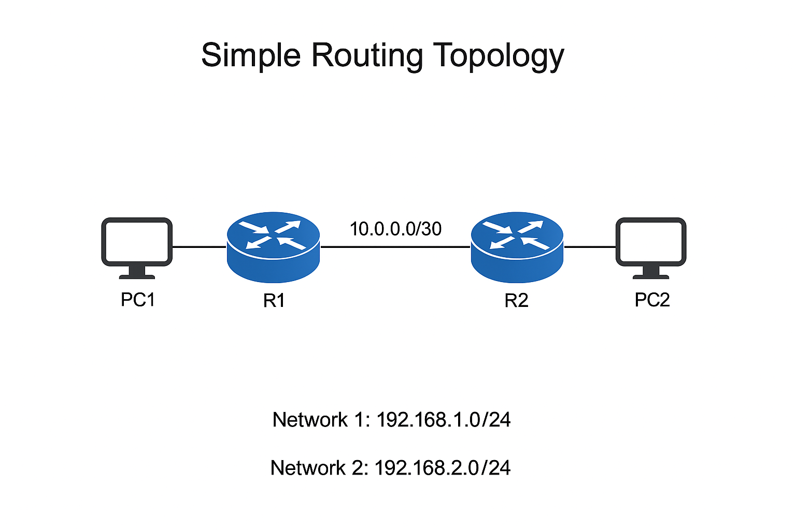

Simple Routing Topology

PC1 → R1 → R2 → PC2 path
Default gateways:

PC1 → 192.168.1.1
PC2 → 192.168.2.1

- R1 connected to Network 192.168.1.0/24
- R2 connected to Network 192.168.2.0/24
- Router-to-router link: 10.0.0.0/30
